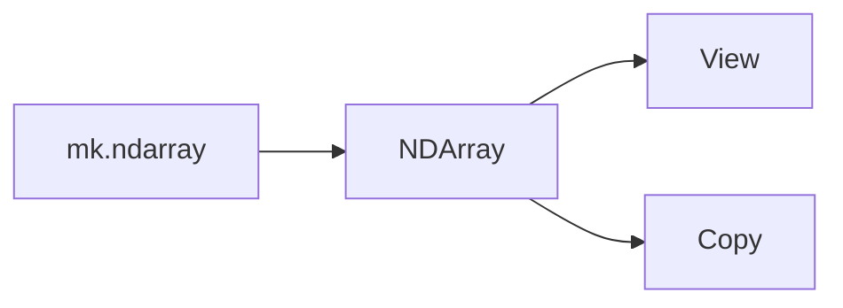

# Writerside Markup Reference

Quick reference for Writerside elements used in Multik docs. The project uses **Markdown format** (not semantic XML) for content pages, with embedded XML elements where needed.

## Table of Contents

- [Summary Elements](#summaries)
- [Headings and Anchors](#headings)
- [Admonitions](#admonitions)
- [Code Blocks](#code-blocks)
- [Tabs](#tabs)
- [Compare Blocks](#compare)
- [Tables](#tables)
- [Lists and Definition Lists](#lists)
- [Links and Cross-References](#links)
- [Seealso Blocks](#seealso)
- [Images](#images)
- [Collapsible Chapters](#collapsible)
- [TLDR Blocks](#tldr)
- [Procedures](#procedures)
- [Mermaid Diagrams](#mermaid)
- [Topic Labels](#labels)
- [Variables](#variables)
- [Landing Pages (.topic XML)](#landing-pages)

---

## Summary Elements {#summaries}

Every page needs three summaries, in this order, right after the H1 title:

```markdown
<web-summary>
2-3 sentences for search engine snippets and meta description.
</web-summary>

<card-summary>
1-2 sentences for card previews in seealso blocks and landing pages.
</card-summary>

<link-summary>
One sentence for link hover popups.
</link-summary>
```

These are not visible in page content — they're metadata for navigation and SEO.

---

## Headings and Anchors {#headings}

```markdown
# Page Title          — exactly one H1 per page, always first line
## Major Section      — main content divisions
### Subsection        — within sections
#### Sub-subsection   — rarely needed
```

### Anchor IDs

For deep linking to specific sections. Two styles:

**Separate line** (used in multi-function API pages):
```markdown
## mean

{id="mean"}
```

**Inline** (used occasionally):
```markdown
## Core concepts {id="overview-core-concepts"}
```

Link to anchors: `[`mean`](descriptive-statistics.md#mean)`

---

## Admonitions {#admonitions}

Blockquote-based notes, warnings, and tips:

```markdown
> Tip text — optional helpful advice.
> {style="tip"}

> Note text — important information the reader should know.
> {style="note"}

> Warning text — critical info about harmful consequences.
> {style="warning"}
```

Multi-paragraph:

```markdown
> First paragraph.
>
> Second paragraph.
>
> {style="note"}
```

Default blockquote (no style attribute) renders as a tip.

---

## Code Blocks {#code-blocks}

````markdown
```kotlin
val a = mk.ndarray(mk[1, 2, 3])
```
````

Language tags used in Multik: `kotlin`, `groovy`, `bash`, `xml`.

### Output conventions

- Single-line output: inline comment `// [1, 2, 3]`
- Multi-line output: block comment `/* ... */`
- Sometimes explicit `println()` + output comment

### Collapsible code blocks

```markdown
```kotlin
{collapsible="true" collapsed-title="Click to expand"}
// long code example
```
````

---

## Tabs {#tabs}

Switch between alternative content (e.g., Gradle Kotlin vs Groovy):

```xml
<tabs group="languages" id="unique-tab-id">
<tab title="Gradle (Kotlin)" group-key="kotlin">

```kotlin
implementation("org.jetbrains.kotlinx:multik-core:%mk_latest_version%")
```

</tab>
<tab title="Gradle (Groovy)" group-key="groovy">

```groovy
implementation 'org.jetbrains.kotlinx:multik-core:%mk_latest_version%'
```

</tab>
</tabs>
```

- `group` syncs tab selection across the page (same `group` switch together)
- `id` must be unique per page
- `group-key` links tabs across different `<tabs>` blocks
- **Blank lines required** between `<tab>` tags and markdown content

---

## Compare Blocks {#compare}

Side-by-side or top-bottom comparison of code:

```xml
<compare first-title="stdlib Kotlin" second-title="Multik" type="top-bottom">

```kotlin
// First code
```

```kotlin
// Second code
```

</compare>
```

Types: `"top-bottom"`, `"left-right"`.

---

## Tables {#tables}

Standard Markdown pipe tables:

```markdown
| Parameter | Type    | Description           |
|-----------|---------|-----------------------|
| `param1`  | `Type1` | Description of param. |
| `param2`  | `Type2` | Description of param. |
```

For more complex tables (spanning cells, custom widths), use the XML `<table>` element:

```xml
<table>
    <tr><td width="200">Column 1</td><td>Column 2</td></tr>
    <tr><td>value</td><td>value</td></tr>
</table>
```

Table styles: `style="header-row"` (default), `"header-column"`, `"both"`, `"none"`.

---

## Lists and Definition Lists {#lists}

Standard Markdown lists work:

```markdown
- Bullet item
- Another item
  - Nested item

1. Numbered item
2. Another item
```

### Definition Lists

Useful for parameter descriptions, FAQ, glossaries:

```markdown
Term
: Definition of the term.

Another Term
: Its definition.
```

Or in XML:
```xml
<deflist>
    <def title="Term">Definition.</def>
    <def title="Another Term">Definition.</def>
</deflist>
```

Definition lists support collapsible behavior with `collapsible="true"`.

---

## Links and Cross-References {#links}

### Auto-titled link (resolves to page title)
```markdown
[](page-name.md)
```

### Custom text link
```markdown
[link text](page-name.md)
```

### Deep link with anchor
```markdown
[`mean`](descriptive-statistics.md#mean)
```

### External link
```markdown
[Kotlin documentation](https://kotlinlang.org/docs/multiplatform.html)
```

### Custom link summary (hover tooltip)
```markdown
[Link text](page.md "Custom hover text")
```

### HTML anchor (in blockquotes and seealso blocks)
```html
<a href="page.md" summary="Hover description."/>
<a href="page.md">Custom Link Text</a>
```

---

## Seealso Blocks {#seealso}

Always at the very end of a page. Renders as cards with links to related content.

### Basic
```xml
<seealso style="cards">
<category ref="api-docs">
  <a href="page.md" summary="Brief description."/>
</category>
</seealso>
```

### With title and multiple categories
```xml
<seealso style="cards" title="Next steps">
<category ref="user-guide">
  <a href="page.md" summary="Description."/>
</category>
<category ref="api-docs">
  <a href="page.md" summary="Description.">Custom Title</a>
</category>
</seealso>
```

Category refs defined in `docs/cfg/c.list`:
- `"api-docs"` — API Reference
- `"user-guide"` — User Guide
- `"get-start"` — Getting Started
- `"ext"` — External links

Self-closing `<a ... />` uses page title as link text. Use `<a ...>Text</a>` for custom text.

---

## Images {#images}

```markdown

{ width="700" }
```

Images stored in `docs/images/`. Reference by filename only (Writerside resolves the path).

### Dark theme variants

Name images: `example.png` and `example_dark.png`. Writerside auto-switches based on reader's theme. Only reference the light version in markup.

### Thumbnails (for wide images)

```markdown
{ thumbnail="true" }
```

Renders as clickable thumbnail that expands on click.

---

## Collapsible Chapters {#collapsible}

Hide non-essential information behind expandable sections:

```markdown
## Optional details {collapsible="true"}

Content hidden by default, reader clicks to expand.
```

Default expanded (collapsible but shown):

```markdown
## Details {collapsible="true" default-state="expanded"}
```

Note: collapsed content is **not searchable** via browser Ctrl+F — don't collapse important info.

---

## TLDR Blocks {#tldr}

Quick facts at the top of a topic or chapter:

```xml
<tldr>
    <p>Shortcut: <shortcut>Ctrl+Space</shortcut></p>
    <p>Available: JVM, JS, Native, WASM</p>
</tldr>
```

Renders as a compact info bar. Keep it to 1-3 short, actionable facts. One per topic/chapter.

---

## Procedures {#procedures}

Step-by-step instructions that stand out visually:

```xml
<procedure title="Add Multik to your project" id="add-multik">
    <step>Open your <path>build.gradle.kts</path>.</step>
    <step>Add the dependency.</step>
    <step>Sync the project.</step>
</procedure>
```

Procedures are more visually prominent than ordered lists. Use them for task-oriented instructions in Getting Started and User Guide pages.

---

## Mermaid Diagrams {#mermaid}

For architecture diagrams, flowcharts, state diagrams:

````markdown

````

Supports flowcharts, sequence diagrams, state diagrams, Git graphs, pie charts, etc.

---

## Topic Labels {#labels}

Mark topics or chapters as WIP, Beta, version-specific, etc. Labels are defined in `docs/labels.list` and referenced in markdown:

```markdown
## Some chapter
<secondary-label ref="wip"/>
<secondary-label ref="beta"/>
```

The project uses `wip="true"` on `<toc-element>` in `mk.tree` to mark incomplete pages.

---

## Variables {#variables}

Build-time variable replacement:

```
%mk_latest_version%
```

Used in dependency snippets. Variables defined in Writerside project configuration.

---

## Markdown Comments {#comments}

```markdown
[//]: # (TODO: add more examples)
```

Not rendered in output. Useful for leaving notes for future updates.

---

## Landing Pages (.topic XML) {#landing-pages}

Pure XML format for section entry points. Rarely created, usually just edited.

```xml
<?xml version="1.0" encoding="UTF-8"?>
<!DOCTYPE topic SYSTEM "https://resources.jetbrains.com/writerside/1.0/xhtml-entities.dtd">
<topic xmlns:xsi="http://www.w3.org/2001/XMLSchema-instance"
       xsi:noNamespaceSchemaLocation="https://resources.jetbrains.com/writerside/1.0/topic.v2.xsd"
       title="Section Title" id="section-id">

    <section-starting-page>
        <title>Section Title</title>
        <description>1-2 sentences.</description>

        <spotlight>
            <a href="primary.md" type="academy" summary="Description.">Primary</a>
            <a href="secondary.md" type="start" summary="Description.">Secondary</a>
        </spotlight>

        <primary>
            <title>Core topics</title>
            <a href="page.md" type="check-list" summary="Description.">Page</a>
        </primary>

        <secondary>
            <title>More resources</title>
            <a href="page.md" type="settings" summary="Description.">Page</a>
        </secondary>
    </section-starting-page>
</topic>
```

Link `type` values (for icons): `"academy"`, `"start"`, `"check-list"`, `"learn"`, `"install"`, `"cross-platform"`, `"settings"`, `"support"`, `"branch"`, `"library"`, `"tools"`, `"open-source"`, `"search"`, `"data"`, `"experiment"`.

### Topic-level switcher

For pages with platform-specific content:

```markdown
---
switcher-label: Platform
---

## JVM Setup {switcher-key="JVM"}
...

## Native Setup {switcher-key="Native"}
...
```
